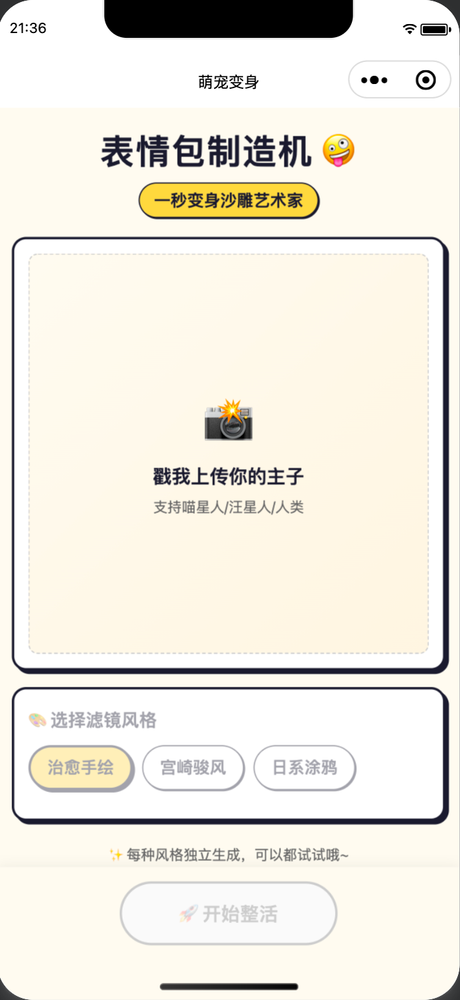
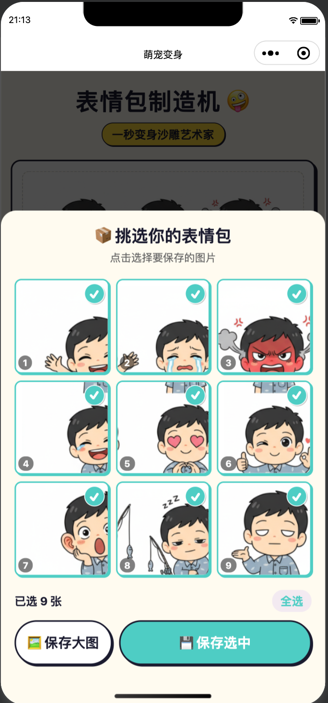

# 🤖 萌宠表情包工坊 (Pet Meme Workshop)

> **"让每一只毛孩子都成为朋友圈的梗王"**
> *One-click AI Meme Generator for Gen Z Pet Owners*


---

## 📱 产品展示 (Product Showcase)

<div align="center">
  
  
</div>

<div align="center">
  <strong>左图：主界面 (Main) · 右图：生成结果页 (Result)</strong>
</div>

<br/>

**"单主角舞台"交互模式**：从上传照片到生成表情包，用户只需一步操作。系统会自动识别宠物特征，结合用户选择的风格（如“宫崎骏风”、“手绘风”），生成带有趣味文案的专属表情包。

---

## 💡 产品愿景 (Product Vision)

作为一个 **AI Product Manager** 的个人展示项目，**萌宠表情包工坊** 旨在探索 **Generative AI 在 C 端社交场景的落地**。它解决了 Z 世代宠物主在社交分享中的“配文焦虑”和“修图门槛”。

### 🎯 用户画像 (Target Persona)
*   **核心用户**：95后/00后“铲屎官”，重度社交媒体用户。
*   **痛点**：
    *   相册里堆积了大量宠物照片，但缺乏创意加工能力，导致朋友圈内容同质化。
    *   现有的修图软件操作繁琐，而通用的 AI 生成工具（如 Midjourney）提示词门槛过高（Prompt Complexity）。

### ✨ 核心体验 (Key Experience)
1.  **零门槛交互 (Zero-Friction)**: 隐藏底层复杂的 Prompt 工程，用户仅需“上传+选择风格”两步。
2.  **情绪价值设计 (Emotional Design)**: 采用高饱和度的“多巴胺”配色（Dopamine UI）和圆角卡片设计，传递快乐、治愈的情绪基调。
3.  **个性化保留 (Identity Retention)**: 相比于随机生成，本项目着重于保留用户宠物的核心特征，让生成的 Meme 既有趣又是“自家的崽”。

---

## 🛠 技术实现与 AI 策略 (Technical & AI)

本项目展示了从 **需求洞察 -> Prompt 设计 -> 全栈开发** 的完整闭环能力。

### 🧠 Prompt Engineering 策略
为了保证输出极其稳定的高质量表情包，后端采用了动态 Prompt 构建管线：

*   **视觉锚定 (Visual Anchoring)**: 解析上传图片的特征，确保生成的 Meme 依然是用户的“那只”宠物。
*   **风格注入 (Style Injection)**: 通过 `style_modifiers` 动态注入艺术风格（如：`"Ghibli style, vibrant colors, soft lighting"`）。
*   **文本增强 (Contextual Captioning)**: AI 自动联想符合画面语境的流行语（如：“本汪累了”、“打工人”、“emo时刻”）。

### 🏗 架构设计 (Architecture)
*   **Client**: 微信小程序原生开发 (WXML/WXSS/JS)，实现秒开体验。
*   **Server**: Node.js + Express 中间层，负责鉴权、Rate Limiting 以及构建 Prompt 请求。
*   **Model**: 灵活集成 **Gemini Flash / DALL·E 3**，通过 API 完成图像生成。

---

## 🚀 快速开始 (Developer Guide)

### 1. 后端服务 (Backend)

```bash
cd backend
npm install
# 复制配置文件并填入 API Key
cp .env.example .env 
node index.js
```
*服务默认运行在 `http://localhost:3000`*

### 2. 小程序前端 (Frontend)

1. 打开 **微信开发者工具**。
2. 点击导入项目，选择 `miniprogram` 目录。
3. 在详情设置中，勾选 **“不校验合法域名、web-view（业务域名）、TLS版本以及HTTPS证书”**。
4. 编译并运行，即可预览。

---

## 📅 Roadmap

*   [x] **MVP**: 核心上传与生成功能完成，验证 AI 生成流程。
*   [ ] **V1.1**: 增加“社区广场”功能，沉淀优质 Meme 内容。
*   [ ] **V1.2**: 引入 LoRA 微调功能，支持用户针对自家宠物训练专属模型，提高相似度。
*   [ ] **V2.0**: 视频生成支持 (AI Video Meme)，探索多模态交互新形式。
